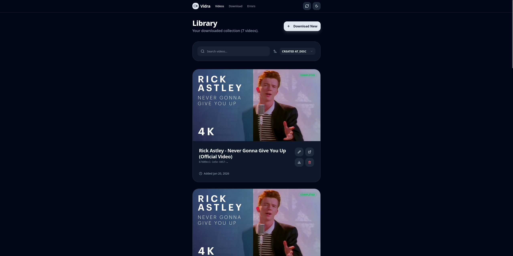
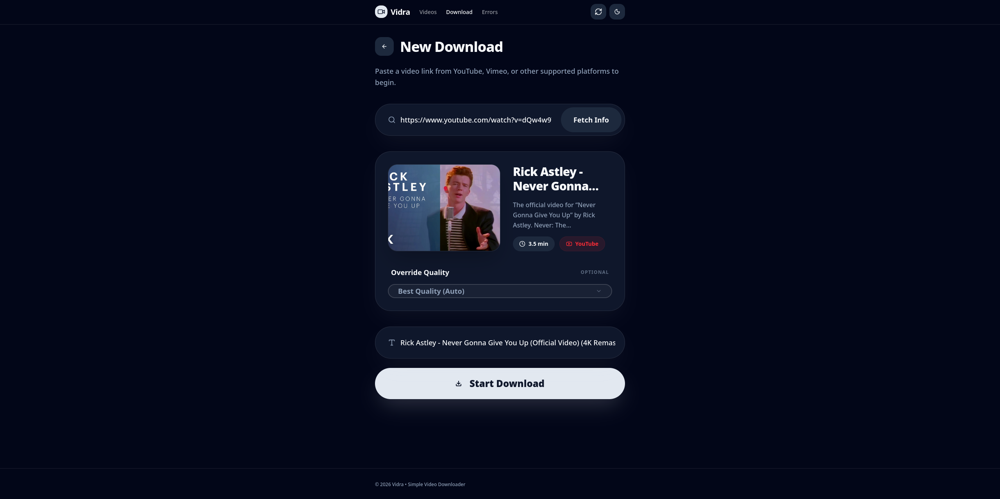
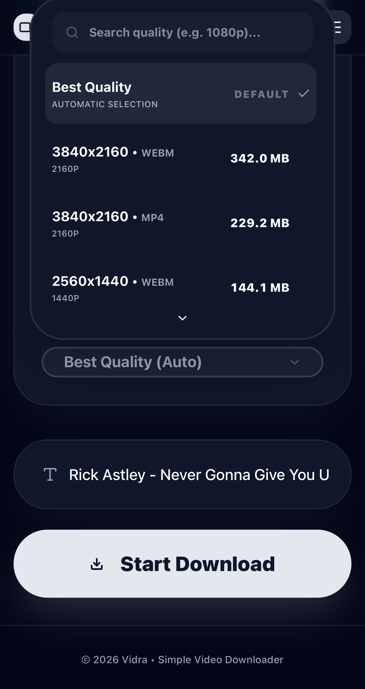
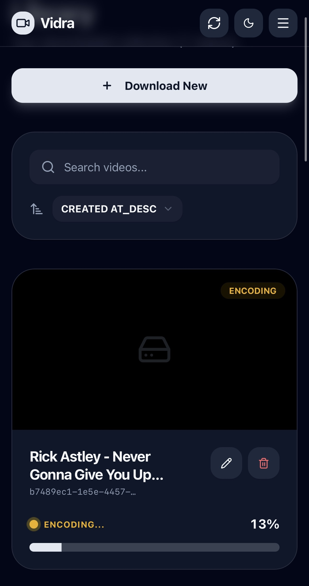

# 🦦 Vidra

Vidra is a high-performance, full-stack video downloader that leverages the power of `yt-dlp` and `ffmpeg` to provide a seamless downloading experience. It features a robust Go backend and a reactive Svelte 5 frontend.

---

## Screenshots

### Desktop

<div align="center">
  
  <p><em>Main library dashboard</em></p>
  
  <p><em>New download interface</em></p>
</div>

### Mobile

<div align="center">
  <table border="0">
    <tr>
      <td></td>
      <td></td>
      <td></td>
      <td></td>
    </tr>
    <tr>
      <td align="center">Library</td>
      <td align="center">New Download</td>
      <td align="center">Format Selection</td>
      <td align="center">Active Progress</td>
    </tr>
  </table>
</div>

---

## ⚡ Quick Start (Recommended)

You don't need to clone the entire repository to run Vidra. You can just download the required configuration files and start:

```bash
# 1. Create a directory for Vidra
mkdir vidra && cd vidra

# 2. Download the configuration files
curl -L https://raw.githubusercontent.com/Azmekk/Vidra/master/docker-compose.yml.example -o docker-compose.yml
curl -L https://raw.githubusercontent.com/Azmekk/Vidra/master/nginx.conf -o nginx.conf

# 3. Launch
docker compose up -d
```

> [!IMPORTANT]
> **Before launching, please check:**
>
> - **Port 80**: By default, Vidra uses port 80. If you already have a web server (like another Nginx instance) running on port 80, you must change the `ports` mapping in `docker-compose.yml` (e.g., `"8080:80"`).
> - **Downloads Folder**: Videos are saved to `./downloads` relative to where you run the command. Ensure this directory is writable and that you have enough disk space. You can change this path in the `volumes` section of both the `backend` and `proxy` services in `docker-compose.yml`.

Access the web interface at **`http://localhost`** (or your custom port).

---

## 🛠 CI/CD & Docker Images

This project uses GitHub Actions to automatically build and publish production-ready Docker images to the GitHub Container Registry (GHCR). **Pulling these images is the preferred way to run Vidra.**

- **Backend Image**: `ghcr.io/azmekk/vidra-backend:main`
- **Frontend Image**: `ghcr.io/azmekk/vidra-frontend:main`

## 🛠 Technologies

### Backend


### Frontend


---

## 🏗 Project Structure

- **`backend/`**: Go REST API using Chi, `sqlc` for database interactions, and background worker orchestration.
- **`frontend/`**: Modern Svelte 5 application using Runes for reactive state management and Tailwind CSS 4 for styling.
- **`nginx.conf`**: Proxy configuration to serve both the API and the static frontend from a single port.

## 📜 License

This project is licensed under the AGPL-3.0 License - see the [LICENSE](LICENSE) file for details.
