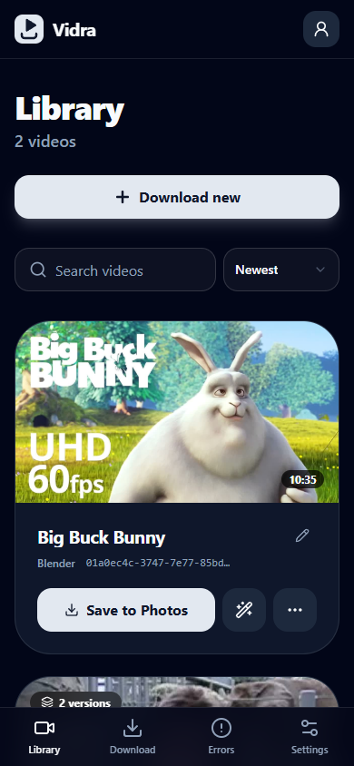
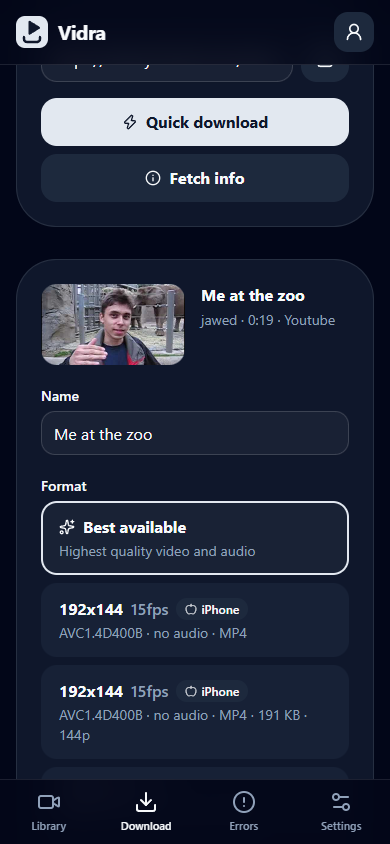
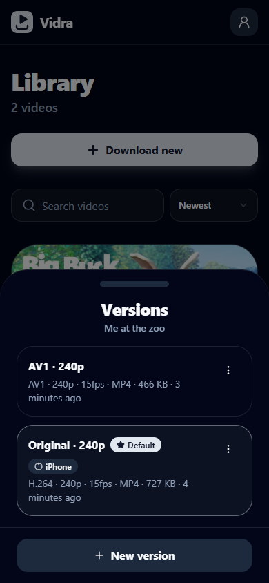
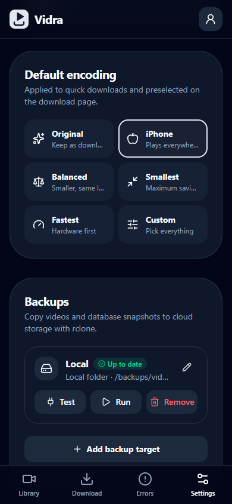

# Vidra

Vidra is a self-hosted, mobile-first video downloader. Paste a link from YouTube, TikTok, Instagram or any other site [yt-dlp](https://github.com/yt-dlp/yt-dlp) supports, and Vidra downloads it, keeps every version you make of it, and puts it one tap away from your phone's photo library.

It ships as one small Go binary with the web app built in, SQLite for storage and a single Docker image.

## Features

- **Quick download.** Paste a link (or a whole "shared via…" message) and go. Vidra finds the link, names the video, and fills in the real title when it lands.
- **Versions.** Keep the original and re-encode it any time to H.264, HEVC, AV1 or VP9. Pick which version is the default.
- **Smart encoding.** Choose a goal (iPhone, Balanced, Smallest, Fastest) and get a recommended profile with reasons, or set every ffmpeg option yourself. Working hardware encoders are detected automatically.
- **Save to Photos on iPhone.** One tap opens the share sheet with the video ready to save. Versions that won't play on iOS get a one-tap "Make iPhone version".
- **Installable app.** A PWA with offline shell, share target on Android and an iOS Shortcut via API tokens.
- **Backups.** Copy videos and database snapshots to S3/R2, Google Drive, MEGA or a local folder with rclone, configured from Settings.
- **Live progress** over WebSocket, cancellable jobs, infinite-scroll library, search and an error log.

## Screenshots

<div align="center">
  <table border="0">
    <tr>
      <td></td>
      <td></td>
      <td></td>
      <td></td>
    </tr>
    <tr>
      <td align="center">Library</td>
      <td align="center">Download</td>
      <td align="center">Versions</td>
      <td align="center">Settings</td>
    </tr>
  </table>
</div>

## Quick start

```bash
mkdir vidra && cd vidra
curl -L https://raw.githubusercontent.com/Azmekk/Vidra/master/docker-compose.example.yml -o docker-compose.yml
docker compose up -d
docker compose logs vidra | grep "setup code"
```

Open Vidra, enter the setup code from the log and create your account. The code is only printed while no account exists.

Vidra is meant to run behind HTTPS (Caddy, Traefik, Cloudflare Tunnel, …). Session cookies are `Secure`, and Save to Photos needs a secure context. To try it over plain HTTP on your LAN, set `VIDRA_INSECURE_COOKIES=true`.

### Configuration

| Variable | Default | Purpose |
| --- | --- | --- |
| `PORT` | `8080` | HTTP port |
| `DB_PATH` | `/app/data/vidra.db` | SQLite database |
| `DOWNLOADS_DIR` | `/app/downloads` | Videos and thumbnails |
| `VIDRA_INSECURE_COOKIES` | `false` | Allow sessions over plain HTTP |

Everything else, including proxy, concurrency, default encoding and backups, lives in **Settings**.

When a reverse proxy runs on the same host or Docker network, Vidra trusts its `X-Forwarded-For` header for rate limiting. Requests from public addresses are keyed by their own IP.

## iPhone

1. Open Vidra in Safari and choose **Share → Add to Home Screen**.
2. For sharing straight from other apps, create an API token in **Settings → API tokens** and make a Shortcut that accepts URLs and text from the share sheet and runs **Get Contents of URL**:
   - URL: `https://your-vidra/api/videos/quick`
   - Method: `POST`, header `Authorization: Bearer <token>`
   - JSON body: `url` = *Shortcut Input*

   Vidra pulls the link out of whatever text the app shares. Alternatively, have the Shortcut open `https://your-vidra/download?quick=1&url=<Shortcut Input>`.

## Backups

In **Settings → Backups**, add one or more targets:

- **S3 / R2** (AWS, Cloudflare R2, Wasabi, MinIO, …): endpoint, keys and `bucket/folder`.
- **Google Drive**: run `rclone authorize "drive"` on any computer and paste the token.
- **MEGA**: email and password.
- **Local folder**: any absolute path, e.g. a mounted NAS share.

Finished versions and thumbnails upload as they complete, deleted ones are removed from the remote, and the database is snapshotted shortly after changes and daily (`db/vidra-latest.db` plus the last 7). **Run** copies everything again and is safe to repeat.

## Migrating from Vidra 1.x (Postgres)

The image includes `pg2sqlite`. Stop the old stack, keep its `downloads` folder, and run:

```bash
docker run --rm --network <old-network> -v ./data:/app/data -v ./downloads:/app/downloads ghcr.io/azmekk/vidra:latest \
  ./pg2sqlite --pg "postgres://postgres:password@db:5432/vidra?sslmode=disable" \
  --out /app/data/vidra.db --downloads /app/downloads
```

Every old video becomes a video with one original version, and files on disk keep their names. Then start the new compose file with the same `downloads` folder.

## Development

Requirements: Go 1.27, Bun, sqlc, swag, ffmpeg and yt-dlp (rclone and deno optional).

```bash
cd src/backend
sqlc generate && ./scripts/swag_init.sh
VIDRA_INSECURE_COOKIES=true go run .

cd src/frontend
bun install
bun run dev
```

The Vite dev server proxies `/api` to `:8080`. See [CLAUDE.md](CLAUDE.md) for layout and conventions.

## License

AGPL-3.0. See [LICENSE](LICENSE).
